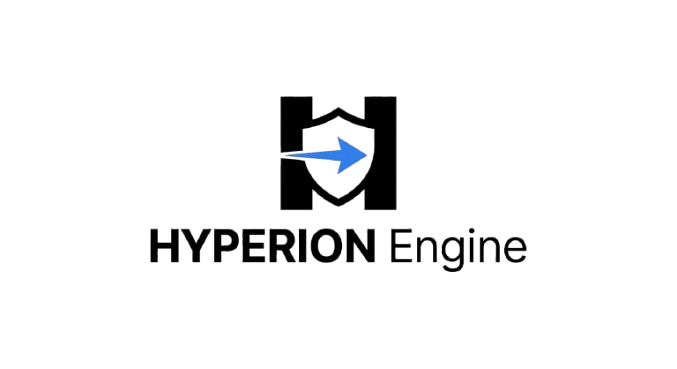
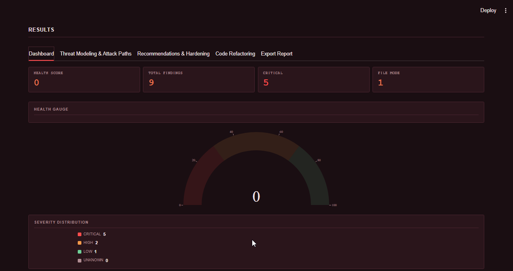

<p align="center">
  
</p>

<h1 align="center">Hyperion Security Engine</h1>

<p align="center">
  <em>AI-powered DevSecOps platform for static analysis, threat modeling, and automated remediation.</em>
</p>

<p align="center">
  <a href="https://www.python.org/downloads/"></a>
  <a href="https://streamlit.io/"></a>
  <a href="LICENSE"></a>
  <a href="https://www.reportlab.com/"></a>
  <a href="https://plotly.com/python/"></a>
</p>

---

## Table of Contents

- [Overview](#overview)
- [Features](#features)
- [Tech Stack](#tech-stack)
- [Architecture](#architecture)
- [Screenshots](#screenshots)
- [Installation](#installation)
- [Configuration](#configuration)
- [Usage](#usage)
- [Project Structure](#project-structure)
- [Contributing](#contributing)
- [License](#license)

---

## Overview

Hyperion Security Engine is a unified security analysis platform that combines AST-based static analysis, real-time CVE detection, and AI-driven threat modeling into a single Streamlit-powered workspace. The platform is designed to surface vulnerabilities during the development lifecycle — at the point where remediation is fastest and cheapest — rather than as an afterthought in production.

Modern applications ship with growing dependency graphs and increasingly sophisticated attack surfaces. Traditional static analysis tools generate noise without context, and AI-driven security tools often lack the deterministic grounding needed to be trustworthy. Hyperion addresses both problems by pairing a strict Python pattern scanner and the OSV vulnerability database with a structured AI analysis pipeline that produces schema-validated outputs every run.

The engine supports single-file scanning, GitHub repository cloning, and an offline demo mode backed by a deterministic cache — making it equally useful for live development workflows and for evaluation in air-gapped environments.

---

## Features

| Feature | Description |
|---|---|
| **AST Static Analysis** | Deterministic Python pattern detection using the `ast` module for SQL injection, dangerous deserialization, command injection, hardcoded secrets, and unsafe YAML loading. |
| **Real-time CVE Detection** | Live lookup against the OSV.dev API for transitive dependency vulnerabilities, with severity scoring and fixed-version guidance. |
| **AI Threat Modeling** | LLM-driven attack path generation grounded in real findings, producing schema-validated JSON with narrative proof-of-concept steps. |
| **Attack Graph Visualization** | Graphviz-rendered attack flow diagrams that map vulnerabilities to exploitable paths and surface lateral movement risk. |
| **AI Code Remediation** | Side-by-side original-vs-refactored source comparison using `difflib`, with one-click download of the corrected file. |
| **PDF Security Reports** | Print-ready dark-themed reports built with ReportLab, including health score, vulnerability tables, and recommendations. |
| **GitHub Repo Scanning** | Shallow-clone support for whole-repository audits with per-file pattern analysis and dependency aggregation. |
| **Instant Demo Mode** | Local cache replay for offline evaluation — no API key required to explore the full UI surface. |

---

## Tech Stack

| Layer | Technology | Version |
|---|---|---|
| Language | Python | 3.12 |
| UI Framework | Streamlit | 1.63+ |
| Charts | Plotly | 7.0+ |
| Data | Pandas | 3.0+ |
| PDF Generation | ReportLab | 5.0+ |
| Graph Rendering | Graphviz | 0.21+ |
| Config | python-dotenv | 1.2+ |
| Serialization | PyYAML | 6.0+ |
| LLM Transport | urllib (stdlib) | — |
| AI Backend | Any OpenAI-compatible endpoint | — |

---

## Architecture

```
            ┌─────────────────────────────────────────────┐
            │           Streamlit UI (app.py)             │
            └──────────┬──────────────┬───────────────────┘
                       │              │              │
                       ▼              ▼              ▼
            ┌──────────────┐  ┌──────────────┐  ┌──────────────┐
            │  scanner.py  │  │ dependency_  │  │ repo_scanner │
            │ AST patterns │  │ check.py     │  │ .py git clone│
            └──────┬───────┘  │ OSV.dev API  │  └──────────────┘
                   │          └──────┬───────┘
                   └─────────────────┘
                                 │
                                 ▼
                   ┌───────────────────────┐
                   │     ai_llm.py         │
                   │ schema_validator.py   │
                   └────────┬──────────────┘
                            │
              ┌─────────────┼──────────────┐
              ▼             ▼              ▼
       ┌──────────┐  ┌──────────┐  ┌──────────┐
       │ LLM API  │  │ fallback │  │   demo   │
       │ (HTTPS)  │  │ analysis │  │  cache   │
       └──────────┘  └──────────┘  └──────────┘
                            │
                            ▼
                  ┌───────────────────────┐
                  │     PDF Export        │
                  │     (ReportLab)       │
                  └───────────────────────┘
```

The pipeline runs end-to-end inside the Streamlit app: input is dispatched to the appropriate scanner, findings are aggregated, AI analysis is requested (with deterministic fallback on failure), and the resulting schema-validated dictionary drives the dashboard, attack visualizations, and export features.

---

## Screenshots

### Dashboard

The main command center showing real-time health score gauge, severity
distribution donut, OWASP category breakdown, scan findings table,
and dependency CVE findings — all in a single dense view.

<p align="center">
  
</p>
<p align="center">
  
</p>
<p align="center">
  
</p>
<p align="center">
  
</p>

---

### Threat Modeling & Attack Paths

AI-generated attack graph visualization using Graphviz, showing how
vulnerabilities chain into exploitable attack paths. Includes
narrative proof-of-concept steps mapped to each finding.

<p align="center">
  
</p>

---

### Recommendations & Hardening

Three-panel remediation guidance: immediate fixes ranked by severity,
architecture-level hardening measures, and CI/CD pipeline guardrails
to prevent future vulnerabilities.

<p align="center">
  
</p>

---

### Code Refactoring

Side-by-side diff view of original vs AI-refactored source code,
with line-level change statistics and one-click download of the
corrected file.

<p align="center">
  
</p>

---

## Installation

### Prerequisites

- Python 3.12
- Git
- Graphviz system binary (`brew install graphviz`, `apt install graphviz`, or Windows installer)

### Clone

```bash
git clone https://github.com/kungfufusionweb-a11y/hyperion-engine.git
cd hyperion-engine
```

### Install dependencies

```bash
pip install -r requirements.txt
```

### Configure environment

```bash
cp .env.example .env
# then edit .env and set HYPERION_LLM_API_KEY
```

See [Configuration](#configuration) below for all environment variables.

### Run

```bash
streamlit run app.py
```

The app opens at `http://localhost:8501`.

---

## Configuration

Hyperion reads its LLM credentials from environment variables. All variables are loaded from `.env` at startup.

| Variable | Description | Required |
|---|---|---|
| `HYPERION_LLM_API_KEY` | API key for the LLM endpoint | Yes (for live AI features) |
| `HYPERION_LLM_API_URL` | Base URL of the OpenAI-compatible API | Yes (for live AI features) |
| `HYPERION_LLM_MODEL` | Model identifier to request | Yes (for live AI features) |

If any of the above is missing or the API call fails, the engine falls back to a deterministic local analysis (`ai_fallback.py`) so the UI remains fully usable.

---

## Usage

Hyperion supports three input modes plus an offline demo mode.

### Paste Code Snippet

Paste Python code into the editor and click **Scan**. Useful for quick analysis of single files or functions.

### Upload File

Upload a `.py` file directly. The engine scans the file contents and auto-runs a dependency check against the project's own `requirements.txt`.

<!-- screenshot -->

### GitHub Repository URL

Paste any public GitHub URL. Hyperion shallow-clones the repository, scans every Python file, and aggregates dependency findings from any detected `requirements.txt`.

<!-- screenshot -->

### Load Demo

Click **Load Demo** to instantly populate the UI from a cached scan result. Useful for offline evaluation or for showcasing the dashboard without consuming API quota. The cache is produced by `dev-tools/cache_demo_scan.py`.

---

## Project Structure

```
hyperion-engine/
├── app.py                       # Streamlit UI (all tabs, charts, export)
├── scanner.py                   # AST-based pattern detection
├── dependency_check.py          # OSV.dev CVE lookup
├── repo_scanner.py              # GitHub repo cloning + aggregation
├── ai_llm.py                    # LLM client (urllib-based, schema-validated)
├── ai_fallback.py               # Deterministic local analysis
├── schema_validator.py          # JSON contract enforcement
├── cve_reference.py             # Curated CVE examples for prompt grounding
├── demo_cache.py                # Local JSON cache for offline demo mode
├── requirements.txt             # Runtime + test dependencies
├── assets/
│   └── hyperion_logo.png        # Brand logo (PDF + README)
├── static/
│   └── hyperion_logo.png        # UI topbar logo
├── dev-tools/
│   └── cache_demo_scan.py       # One-shot demo cache builder
├── tests/                       # Pytest suite
│   ├── test_scanner.py
│   ├── test_dependency_check.py
│   ├── test_repo_scanner.py
│   ├── test_cve_reference.py
│   ├── test_ai_fallback.py
│   ├── test_ai_llm.py
│   └── test_schema_validator.py
└── README.md
```

---

## Contributing

Contributions are welcome. Please open an issue first to discuss the proposed change, then submit a pull request against `main`. Run the test suite locally before submitting:

```bash
pytest tests/
```

---

## License

[MIT](LICENSE) — see the LICENSE file for full text.